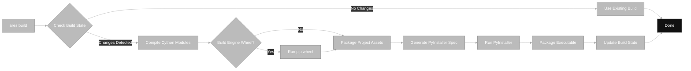

# ARES: Comprehensive Technical Specification

## 1. Introduction

Ares is a cross-platform, modular game engine written in Python 3.12+ with Cython GPU acceleration and Vulkan rendering. It is designed for high performance, rapid iteration, and ease of extension, focusing initially on 2D game development with future 3D capabilities planned. The engine leverages Vulkan as its rendering backend, providing advanced, ultra-fast, and open graphics capabilities. Ares supports modern build systems, a robust CLI, and a flexible configuration system.

## Table of Contents

- [1. Introduction](#1-introduction)
- [2. Features](#2-features)
- [3. Motivation: Why Build a Python/Cython Game Engine?](#3-motivation-why-build-a-pythoncython-game-engine)
- [4. Architecture](#4-architecture)
  - [4.1. Core Modules (ECS Focused)](#41-core-modules-ecs-focused)
  - [4.2. Build System](#42-build-system)
  - [4.3. Configuration](#43-configuration)
  - [4.4. CLI](#44-cli)
  - [4.5. Utilities](#45-utilities)
- [5. Module Details (Pseudo-Algorithms - ECS Adjusted)](#5-module-details-pseudo-algorithms---ecs-adjusted)
  - [5.1. Windowing and Input](#51-windowing-and-input)
  - [5.2. Math and Physics](#52-math-and-physics)
  - [5.3. Renderer](#53-renderer)
  - [5.4. Build System](#54-build-system)
  - [5.5. Configuration](#55-configuration)
  - [5.6. CLI](#56-cli)
  - [5.7. ECS (Entity Component System)](#57-ecs-entity-component-system)
  - [5.8. Asset Management](#58-asset-management)
  - [5.9. Sprite Tween System](#59-sprite-tween-system)
  - [5.10. Hierarchical Finite State Machine (HFSM)](#510-hierarchical-finite-state-machine-hfsm)
  - [5.11. Interaction System](#511-interaction-system)
  - [5.12. UI System (Basic)](#512-ui-system-basic)
- [6. Recommendations & Next Steps (Enhanced)](#6-recommendations--next-steps-enhanced)
  - [6.1. Testing & Quality](#61-testing--quality)
  - [6.2. Documentation](#62-documentation)
  - [6.3. Build System](#63-build-system)
  - [6.4. Engine Features (2D Focus)](#64-engine-features-2d-focus)
  - [6.5. Tooling](#65-tooling)
  - [6.6. Packaging & Distribution](#66-packaging--distribution)
  - [6.7. Community & Contribution](#67-community--contribution)
- [7. Immediate Action Items (Prioritized - ECS Adjusted)](#7-immediate-action-items-prioritized---ecs-adjusted)
- [8. Additional 2D Game Engine Requirements (Expanded - ECS Aligned)](#8-additional-2d-game-engine-requirements-expanded---ecs-aligned)
  - [8.1. Player Movement, Camera & World Loading](#81-player-movement-camera--world-loading)
  - [8.2. Asset Management & Packaging](#82-asset-management--packaging)
  - [8.3. Scene & World Editor](#83-scene--world-editor)
  - [8.4. Conversation & Dialog Editor](#84-conversation--dialog-editor)
- [9. Updated Priority Action Plan (ECS Focused)](#9-updated-priority-action-plan-ecs-focused)
- [10. Conclusion](#10-conclusion)
- [Appendix: Glossary](#appendix-glossary)
- [Appendix: Project Directory Structure](#appendix-project-directory-structure)

## 2. Features

Ares Engine delivers a robust set of features for modern 2D (and future 3D) game development:

- **Cross-Platform:** Windows, Linux, and macOS support.
- **High-Performance:** Cython-accelerated math, physics, and rendering.
- **Vulkan Rendering:** Advanced, ultra-fast, and open graphics via Vulkan backend.
- **Modern Rendering:** Efficient sprite batching, tilemap optimization, 2D lighting, and particle systems.
- **ECS Architecture:** Clean separation of data and logic for scalability and maintainability.
- **Rapid Iteration:** Python scripting, hot-reloading, and fast incremental builds.
- **Integrated Tooling:** Scene and dialog editors (planned), asset management, and CLI utilities.
- **Flexible Configuration:** Layered INI-based system for project, build, and engine settings.
- **Automated Build & Packaging:** OS-independent builds, asset bundling, and PyInstaller integration.
- **Extensible:** Modular design, easy to add new systems, components, and tools.
- **Comprehensive Logging & Telemetry:** For debugging, profiling, and CI integration.
- **State Management:** Hierarchical FSM for complex behaviors.
- **User Interface:** Basic UI system for dialog and menus.
- **Interaction System:** Player-NPC and world object interaction support.

## 3. Motivation: Why Build a Python/Cython Game Engine?

Ares is built to address the needs of both professional developers and hobbyists who want a modern, productive, and extensible engine without sacrificing performance. Our motivations are:

- **Rapid Prototyping:** Python’s expressiveness enables fast iteration and experimentation.
- **Performance Where It Matters:** Cython brings native speed to critical code paths, bridging the gap between Python and C++.
- **Accessibility:** We lower the barrier for new developers, educators, and researchers to understand and extend engine internals.
- **Extensibility:** Python’s ecosystem and dynamic nature make it easy to integrate new tools, scripting, and workflows.
- **Modern Tooling:** We leverage Python’s packaging, build systems, and CLI for a streamlined developer experience.
- **Community & Learning:** Open-source, transparent design encourages contributions and serves as a teaching platform for advanced engine concepts.
- **Cross-Platform Distribution:** Python and Cython enable seamless packaging and deployment across major operating systems.
- **Open Graphics:** By using Vulkan, Ares provides a modern, open, and high-performance graphics API, free from vendor lock-in.

**In summary:** Ares combines the productivity and flexibility of Python with the performance of native code and the power of Vulkan, creating an engine that is both powerful for professionals and accessible to all.

## 4. Architecture

```mermaid
%%{init: {'theme': 'base', 'themeVariables': { 'primaryColor': '#bbb', 'primaryTextColor': '#fff', 'primaryBorderColor': '#777', 'lineColor': '#aaa', 'secondaryColor': '#333', 'tertiaryColor': '#222'}}}%%
graph TD
    subgraph Engine Core
        A[ares.core: Window, Input]
        B[ares.math: Vectors, Matrices]
        C[ares.physics: Physics System]
        D[ares.renderer: Render System (Vulkan)]
        E[ares.ecs: World, Managers]
        F[ares.assets: Asset Manager]
        G[ares.audio: Audio System]
        H[ares.scripting: Scripting System]
        T[ares.animation: Tween System]
        S[ares.fsm: HFSM System]
        U[ares.ui: UI System]
        X[ares.interaction: Interaction System]
    end

    subgraph Build & Utils
        I[ares.utils.build: Builders, Cleaner, Telemetry]
        J[ares.utils.compile: Cython Compiler]
        K[ares.utils.cli: CLI Router, Parser]
        L[ares.config: Config Manager, INI Files]
        M[ares.utils: Logging, Paths, Constants]
        N[ares.utils.hook: PyInstaller Hooks]
    end

    subgraph Tooling
        O[Scene Editor GUI]
        P[Dialog Editor GUI]
    end

    E --> |Manages| A & B & C & D & F & G & H & T & S & U & X
    A & B & C & D & F & G & H & T & S & U & X --> |Process| E

    Engine Core --> |Used By| GameLogic[User Game Project]
    GameLogic --> |Uses| Engine Core
    I & J & K & L & M & N --> |Support| Engine Core
    I & J & K & L & M & N --> |Support| GameLogic
    O & P --> |Generate Data For| GameLogic
    O & P --> |Use| Engine Core

    style GameLogic fill:#111,stroke:#888,stroke-width:2px,color:#fff
    style E fill:#242,stroke:#8a8,stroke-width:2px,color:#fff
```

### 4.1. Core Modules (ECS Focused)

- **ares.core**: Window management, input handling. Provides low-level access for systems.
- **ares.math**: Cython-accelerated vector and matrix math. Used by various components and systems.
- **ares.physics**: Contains `PhysicsSystem` (handles movement, collision detection using spatial partitioning) and `ColliderComponent`.
- **ares.renderer**: Contains `RenderSystem` (handles sprite batching, tilemap rendering, potentially shaders) and visual components (`SpriteComponent`, `TilemapComponent`).
- **ares.ecs**: The core ECS framework.
    - `World`: Container for entities, components, and systems. Manages the main update loop.
    - `EntityManager`: Creates, deletes, and tracks entities (simple IDs).
    - `ComponentManager`: Stores components associated with entities in packed arrays for cache efficiency.
    - `SystemManager`: Registers and executes systems in a defined order.
- **ares.assets**: `AssetManager` for loading/managing assets. Components might hold asset references (e.g., `SpriteComponent` holds texture ID).
- **ares.audio**: `AudioSystem` for sound playback. `AudioSourceComponent` for entities that emit sound.
- **ares.scripting**: `ScriptingSystem` executes logic defined in `ScriptComponent` instances, interacting with other components via the entity ID and `World`.
- **ares.animation**: Contains `TweenSystem` for animating component properties (e.g., `TransformComponent.position`, `SpriteComponent.color`, `SpriteComponent.texture_region`) based on `TweenComponent` data.
- **ares.fsm**: Contains `HFSMSystem` for managing entity states using `StateComponent` data. Includes base `State` class and transition logic.
- **ares.interaction**: Contains `InteractionSystem` for detecting player interaction attempts and triggering events on entities with `InteractableComponent`.
- **ares.ui**: Contains `UISystem` for rendering UI elements, initially focused on dialog boxes defined by `UIComponent`.

### 4.2. Build System



### 4.3. Configuration

- **ares.config**: Layered configuration (project, build, package, engine, logging, assets).
- **INI-based**: Default and user-overridable settings.
- **Dynamic loading**: Configs loaded and initialized as needed.

### 4.4. CLI

```mermaid
%%{init: {'theme': 'base', 'themeVariables': { 'primaryColor': '#bbb', 'primaryTextColor': '#fff', 'primaryBorderColor': '#777', 'lineColor': '#aaa', 'secondaryColor': '#333', 'tertiaryColor': '#222'}}}%%
graph LR
    A[User runs `ares build my_proj --force`] --> B[CLI Parser];
    B --> C{Parse Args: command='build', path='my_proj', force=True};
    C --> D[CLI Router];
    D --> E[BuildCommand.execute(args)];
    E --> F[ProjectBuilder.build()];
    F --> G[Build Success/Failure];

    style G fill:#111,stroke:#888,stroke-width:2px,color:#fff
```

### 4.5. Utilities

- **ares.utils**: Logging, constants, path management, debug tools.
- **ares.utils.compile**: Cython compilation helpers.
- **ares.utils.hook**: PyInstaller runtime hooks for initializing engine systems in frozen builds.

## 5. Module Details (Pseudo-Algorithms - ECS Adjusted)

### 5.1. Windowing and Input
...existing code...

### 5.2. Math and Physics
...existing code...

### 5.3. Renderer
...existing code...

### 5.4. Build System
...existing code...

### 5.5. Configuration
...existing code...

### 5.6. CLI
...existing code...

### 5.7. ECS (Entity Component System)
...existing code...

### 5.8. Asset Management
...existing code...

### 5.9. Sprite Tween System
...existing code...

### 5.10. Hierarchical Finite State Machine (HFSM)
...existing code...

### 5.11. Interaction System
...existing code...

### 5.12. UI System (Basic)
...existing code...

## 6. Recommendations & Next Steps (Enhanced)
...existing code...

## 7. Immediate Action Items (Prioritized - ECS Adjusted)
...existing code...

## 8. Additional 2D Game Engine Requirements (Expanded - ECS Aligned)
...existing code...

## 9. Updated Priority Action Plan (ECS Focused)
...existing code...

## 10. Conclusion

Ares Engine is designed to set a new standard for Python-based game development by combining the clarity and speed of Python/Cython with a modern, modular architecture and professional tooling. This specification outlines a clear, actionable roadmap for building a competitive, extensible, and high-performance engine. By focusing on ECS, robust build systems, and integrated tooling, Ares empowers developers to create sophisticated games and interactive experiences efficiently. By leveraging Vulkan for rendering, Ares ensures advanced, open, and ultra-fast graphics capabilities. We believe that by making engine development more transparent and accessible, we can foster innovation, learning, and a vibrant open-source community.

---

## Appendix: Glossary

| Term                  | Definition                                                                                 |
|-----------------------|--------------------------------------------------------------------------------------------|
| ECS                   | Entity Component System: a design pattern that separates data (components) from logic (systems). |
| Cython                | A superset of Python that compiles to C for performance gains.                             |
| SDL2                  | Simple DirectMedia Layer 2, a cross-platform multimedia library for graphics/input/audio.  |
| Vulkan                | A modern, low-overhead graphics API for high-performance rendering.                        |
| HFSM                  | Hierarchical Finite State Machine: a state machine with nested (hierarchical) states.      |
| Tween                 | Interpolation of values (e.g., position, color) over time for smooth animation.            |
| Asset Manager         | System that loads, caches, and manages game assets (textures, sounds, maps, etc.).         |
| CLI                   | Command-Line Interface: text-based interface for build, clean, and other operations.       |
| PyInstaller           | Tool for packaging Python applications into standalone executables.                        |
| TMX                   | Tiled Map Editor's map file format (XML/JSON), used for 2D tilemaps.                      |
| Component             | A data structure attached to entities (e.g., position, sprite, collider).                  |
| System                | Logic that operates on entities with specific components (e.g., PhysicsSystem).            |
| Entity                | An object in the game world, identified by an ID and composed of components.               |
| Build Artifact        | Output of the build process (e.g., wheel, executable, assets).                             |
| Scene                 | A collection of entities and components representing a game level or world.                |
| Dialog System         | Handles conversations and branching dialog between player and NPCs.                        |
| Interaction System    | Detects and processes player interactions with world objects (e.g., NPCs, items).          |
| UI System             | Manages and renders user interface elements (e.g., dialog boxes, menus).                   |
| Tween System          | Handles smooth transitions of properties (e.g., movement, fading) over time.               |
| Asset Bundling        | Packaging assets with the executable for distribution.                                     |
| Build Cache           | Stores hashes and metadata to enable incremental builds.                                   |
| Build Telemetry       | Logs and reports build times, artifact sizes, and other build metrics.                     |

---

## Appendix: Project Directory Structure

Ares Engine is organized for clarity, scalability, and maintainability. The structure below supports modular development, efficient builds, and easy extension.

```
ares/
├── core/                 # Windowing, Input (Low-level)
│   ├── __init__.py
│   ├── window.py
│   └── input.py
├── math/                 # Cython accelerated math (Vector, Matrix)
│   ├── __init__.py
│   ├── vector.pxd
│   ├── vector.pyx
│   ├── matrix.pxd
│   └── matrix.pyx
├── physics/              # Physics System, Collision Components, Cython helpers
│   ├── __init__.py
│   ├── collision.pxd
│   ├── collision.pyx
│   └── physics_system.py  # Planned
├── renderer/             # Rendering System, Components, Backends (Vulkan)
│   ├── __init__.py
│   ├── renderer.py       # Interface/Facade
│   ├── vulkan.py         # Vulkan Backend Implementation
│   └── render_system.py  # Planned
├── ecs/                  # Entity Component System Core
│   ├── __init__.py       # Planned
│   ├── world.py          # Planned
│   ├── entity_manager.py # Planned
│   ├── component_manager.py # Planned
│   ├── system_manager.py # Planned
│   └── components.py     # Planned (Base Component, Transform, etc.)
├── assets/               # Asset Management
│   ├── __init__.py       # Planned
│   └── asset_manager.py  # Planned
├── audio/                # Audio System and Components
│   ├── __init__.py       # Planned
│   └── audio_system.py   # Planned
├── scripting/            # Scripting System and Components
│   ├── __init__.py       # Planned
│   └── scripting_system.py # Planned
├── animation/            # Animation Systems (Tweening, potentially Skeletal later)
│   ├── __init__.py       # Planned
│   └── tween_system.py   # Planned
├── fsm/                  # Hierarchical Finite State Machine System
│   ├── __init__.py       # Planned
│   ├── hfsm_system.py    # Planned
│   └── state.py          # Planned (BaseState class)
├── interaction/          # Interaction System
│   ├── __init__.py       # Planned
│   └── interaction_system.py # Planned
├── scene/                # Scene loading/saving, potentially scene graph helpers if needed outside ECS
│   ├── __init__.py       # Planned
│   └── scene_loader.py   # Planned
├── ui/                   # UI System and Components
│   ├── __init__.py       # Planned
│   └── ui_system.py      # Planned
├── config/               # Configuration Management (INI files, Parsers)
│   ├── __init__.py
│   ├── ini/              # Default INI files
│   │   ├── assets.ini
│   │   ├── build.ini
│   │   ├── compiler.ini
│   │   ├── engine.ini
│   │   ├── logging.ini
│   │   ├── package.ini
│   │   └── project.ini
│   ├── assets_config.py
│   ├── base_config.py
│   ├── build_config.py
│   ├── compiler_config.py
│   ├── config_manager.py
│   ├── config_types.py
│   ├── config.py
│   ├── engine_config.py
│   ├── logging_config.py
│   ├── package_config.py
│   └── project_config.py
├── utils/                # Utilities (Build, CLI, Compile, Debug, Hooks, Logging, Paths, Spec)
│   ├── __init__.py
│   ├── build/
│   ├── cli/
│   ├── compile/
│   ├── const.py
│   ├── debug/
│   ├── hook/
│   ├── log.py
│   ├── paths.py
│   └── spec/
├── tools/                # Editor GUI Tools (Scene Editor, Dialog Editor)
│   ├── __init__.py       # Planned
│   ├── scene_editor/     # Planned
│   └── dialog_editor/    # Planned
├── __init__.py           # Main package init
└── main.py               # Main CLI entry point

examples/                 # Example projects using the engine
├── hello_world/
│   └── main.py
└── ...                   # Other examples

docs/                     # Documentation
├── Specification.md
└── ...

tests/                    # Unit and integration tests
└── ...

.gitignore
LICENSE
README.md
pyproject.toml
setup.py                  # Generated by build process if needed
```

---

*This document is intended as a comprehensive, professional reference for the design, development, and ongoing evolution of the Ares Engine. For questions, contributions, or further information, please refer to the project repository or contact the maintainers.*
